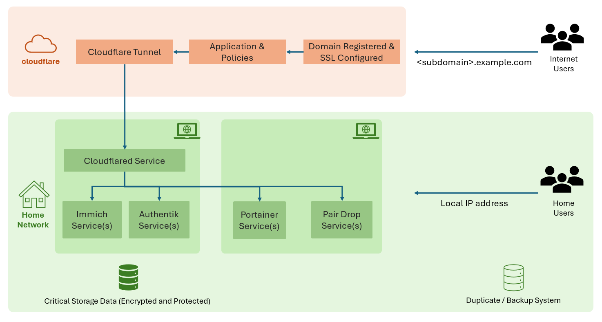
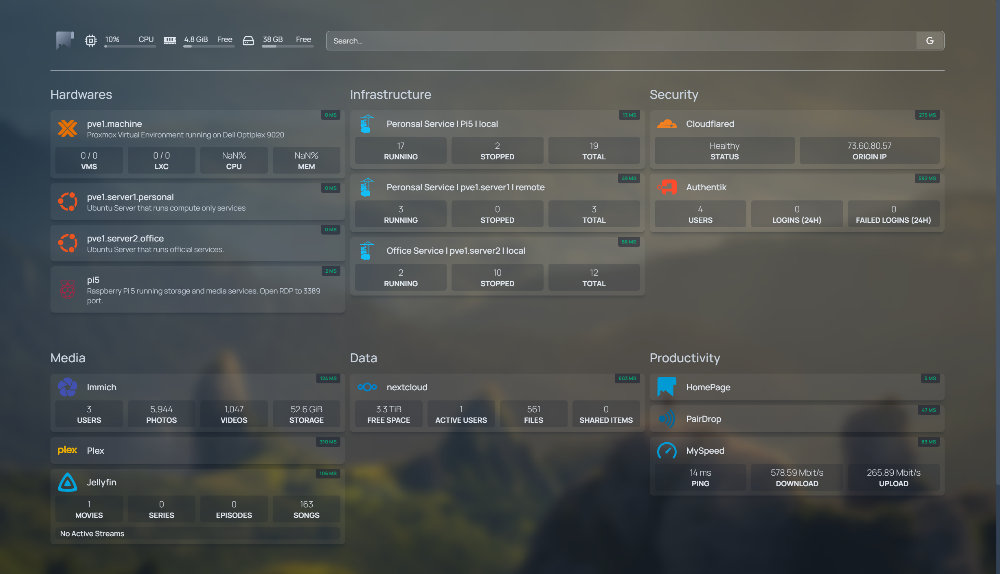

# Home Lab

This repository contains information about how to set up a homelab like your own data center to host your own services like a cloud, media server sync it from phone, manage your data, and have critical services running on your own hardware.

# System Overview

# Dashboard

# List of Setup Guides

- [Setup Raspberry Pi, Ubuntu OS, Docker and required tools](setup-raspberrypi-ubuntu.md)
- [Setup Proxmox for Virtualization](setup-proxmox.md)
- [Setup Portainer to manage all environments, stacks and containers](setup-portainer.md)
- [Setup Immich for Photo Cloud](setup-immich.md)
- [Setup Authentik for Identity Provider](setup-authentik.md)
- [Setup Cloudflare Tunnel for secure public access](setup-cloudflare-tunnel.md)
- [Setup Pairdrop for File Transfer](setup-pairdrop.md)
- [Setup Nextcloud for Cloud Storage](setup-nextcloud.md)
- [Setup gethomepage.dev for Dashboard](setup-homepage-dashboard.md)
- [Connect to Remote using VS Code](connect-remote-using-vscode.md)
- [Setup MySpeed for Speed Test](setup-myspeed.md)
- [Setup Watchtower for Automatic Docker Updates](setup-watchtower.md)
- [Setup Private Registry for Docker Images](setup-private-registry.md)
- [Setup LibreChat for Private ChatGPT Alternative](setup-librechat.md)
- More Awesome Service: **[Awesome Selfhosted Services](setup-awesome-homelabservice.md)**